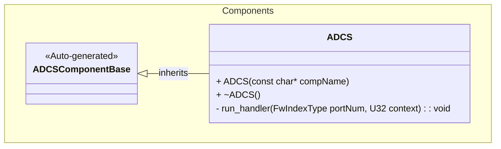
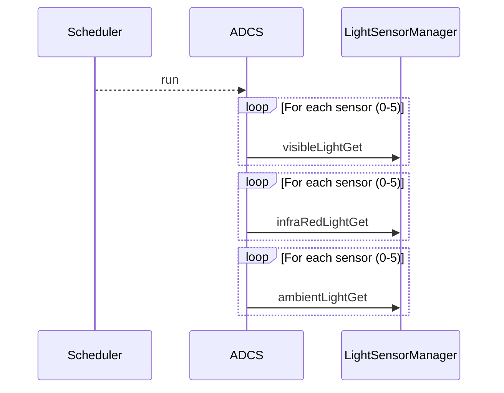

# Components::ADCS

The ADCS (Attitude Determination and Control System) component is responsible for collecting sensor data related to the spacecraft's attitude. Currently, it interfaces with light sensors (VEML6031) to gather visible, infrared, and ambient light data, which can be used for sun sensing and attitude determination.

## Usage Examples

The ADCS component is designed to be scheduled periodically to trigger collection of sensor data. It operates as a passive component that responds to scheduler calls.

### Typical Usage

1. The component is instantiated and initialized during system startup.
2. The scheduler calls the `run` port at regular intervals.
3. On each run call, the component first checks whether this tick is due: the
   sweep executes every `COLLECTION_INTERVAL_S` seconds (default 1, i.e. every
   tick). Ticks in between return immediately.
4. On an executing run call, the component:
   - Iterates through the connected light sensor ports.
   - Fetches visible light data.
   - Fetches infrared light data.
   - Fetches ambient light data.
   - Emits `CollectionIntervalS` with the interval it is running at.

`COLLECTION_INTERVAL_S` is an ordinary F Prime parameter: `..._PRM_SET` latches
it into RAM immediately, and it persists across reboot with `PRM_SAVE_FILE` if
desired; a saved value is applied at boot through the F Prime 4.3.0
`parametersLoaded()` hook, before the first tick, with no PRM_SET needed
(A10). Without a save, a reboot restores the compiled default of 1 s.

## Parameters
| Name | Type | Description |
|---|---|---|
| COLLECTION_INTERVAL_S | U8 | Light-sensor sweep interval in seconds, 1..60, default 1. Out-of-range or invalid values fall back to 1 |

## Telemetry
| Name | Type | Description |
|---|---|---|
| CollectionIntervalS | U8 | The sweep interval actually in force, in seconds. Update on change; downlinked in the `LightSensor` packet (id 13, group 2) |

## Events
| Name | Description |
|---|---|
| CollectionIntervalRejected | Warning emitted when a requested COLLECTION_INTERVAL_S is out of range or the stored value is invalid; the 1 s default stays in force. Throttled at 5 |

## Class Diagram

## Port Descriptions
| Name | Type | Description |
|---|---|---|
| run | sync input | Scheduler port that triggers sensor data collection |
| visibleLightGet | output | Array of ports [6] for getting visible light data from sensors |
| infraRedLightGet | output | Array of ports [6] for getting infrared light data from sensors |
| ambientLightGet | output | Array of ports [6] for getting ambient light data from sensors |
| timeCaller | time get | Port for requesting current system time |
| tlmOut | telemetry | Port for emitting telemetry |
| logOut | event | Port for emitting events |
| logTextOut | text event | Port for emitting text events |
| prmGetOut | param get | Port for getting parameters |
| prmSetOut | param set | Port for setting parameters |
| cmdRegOut | command reg | Port for sending command registrations |
| cmdIn | command recv | Port for receiving commands |
| cmdResponseOut | command resp | Port for sending command responses |

## Sequence Diagrams

## Requirements
| Name | Description | Method | Level | Pass Criteria | Status | Reason |
|---|---|---|---|---|---|---|
|Light Sensor Data Collection|The component shall trigger data collection from connected light sensors when run is called|Verify all connected light sensor output ports are called|||||
|Periodic Operation|The component shall operate as a scheduled component responding to scheduler calls|Verify component responds correctly to scheduler input|||||
|ADCS-1|run shall perform the light-sensor sweep every COLLECTION_INTERVAL_S seconds (1..60), default 1 s|Unit Test|Unit|Over 12 ticks at interval 3 exactly 4 sweeps occur (ticks 1,4,7,10); at the default interval every tick sweeps|||
|ADCS-2|An out-of-range or invalid COLLECTION_INTERVAL_S shall fall back to the 1 s default and report the rejection|Unit Test|Unit|An interval of 0 or >60 or an INVALID param yields effective 1 s, one CollectionIntervalRejected event, and CollectionIntervalS telemetry 1|||
|ADCS-3|A COLLECTION_INTERVAL_S value saved in PrmDb shall be the effective light-sensor sweep interval from the first run tick after boot, without any PRM_SET|Unit Test|Unit|With COLLECTION_INTERVAL_S = 3 VALID in the stub and no parameterUpdated call, after parametersLoaded() 12 ticks perform exactly 4 light-sensor sweeps (ticks 1,4,7,10) and the first CollectionIntervalS write is 3; with paramValidity INVALID (host-stub case: on the target loadParameters leaves VALID or DEFAULT) every tick sweeps, one CollectionIntervalRejected, first write 1; a parameterUpdated after boot applies as today with no duplicate event|||

## Change Log
| Date | Description |
|---|---|
| 2026-09-19 | `parametersLoaded()` override applies a saved COLLECTION_INTERVAL_S at boot; before this the generated `loadParameters()` never reached `parameterUpdated` and a reboot ran on the 1 s default whatever was saved (A10, ADCS-3) |
| 2026-09-05 | Added COLLECTION_INTERVAL_S (1..60 s, default 1) decimation of the light-sensor sweep; CollectionIntervalS telemetry; CollectionIntervalRejected event; the standard command and parameter ports the generated PRM_SET/PRM_SAVE need (ADCS-1/2) |
| 2025-12-04 | Initial ADCS component SDD |
