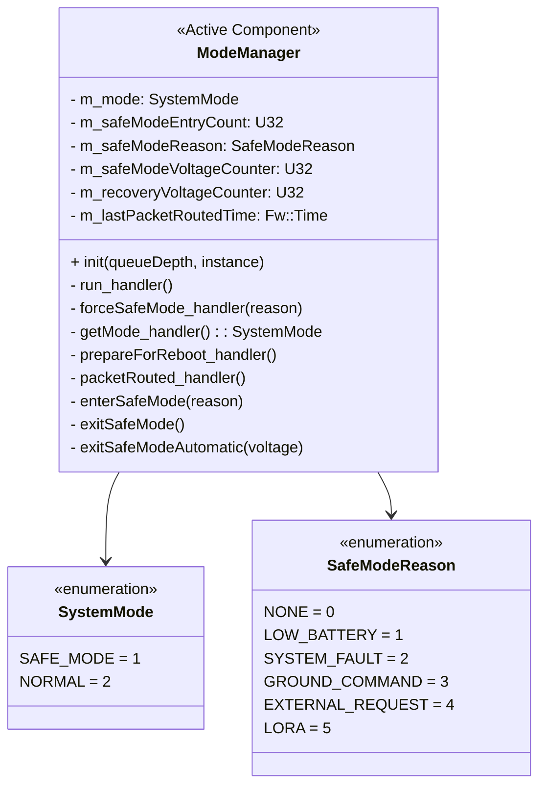
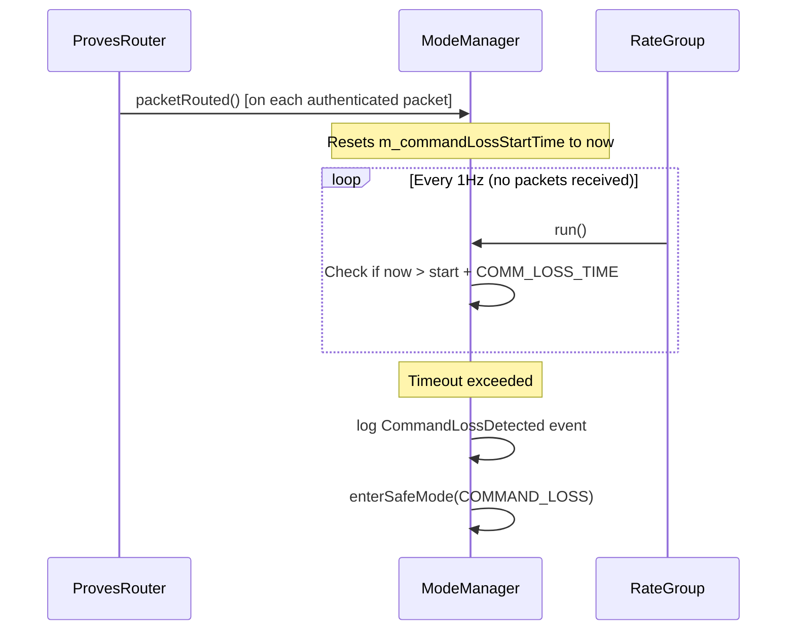
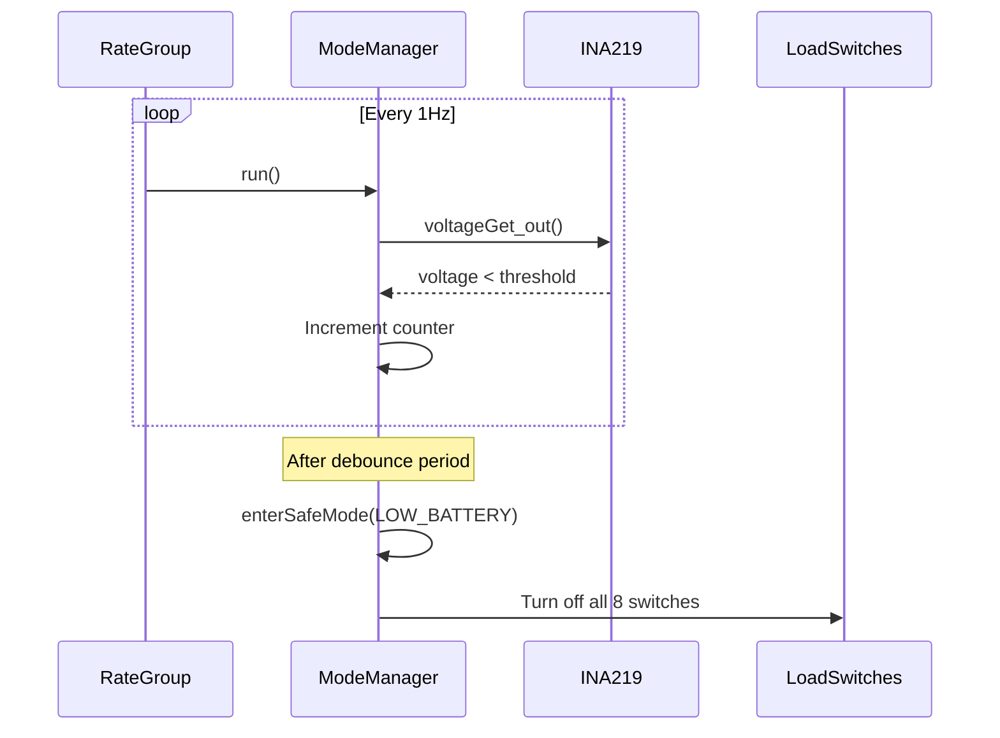
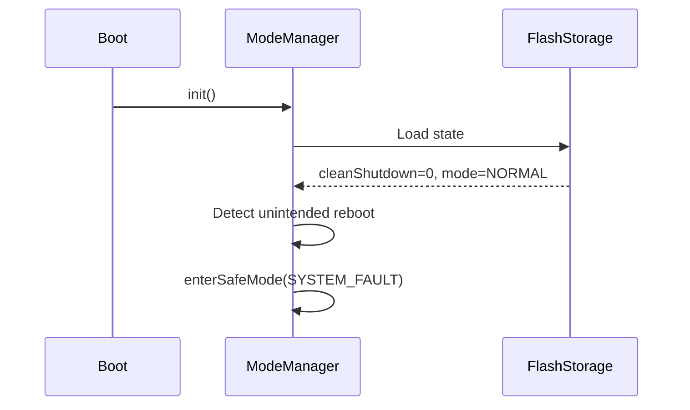

# Components::ModeManager

The ModeManager component manages system operational modes and orchestrates transitions between NORMAL and SAFE_MODE. It evaluates voltage conditions and detects unintended reboots to make mode decisions, controls power to non-critical subsystems during transitions, and maintains/persists mode state across reboots.

## Requirements
| Name | Description | Method | Level | Pass Criteria | Status | Reason |
|---|---|---|---|---|---|---|
|MM0001|The ModeManager shall maintain two operational modes: NORMAL and SAFE_MODE|Integration Test|Board|GET_CURRENT_MODE returns SAFE_MODE after FORCE_SAFE_MODE and NORMAL after EXIT_SAFE_MODE, each within 5 s|||
|MM0002|The ModeManager shall enter safe mode when commanded manually via FORCE_SAFE_MODE command|Integration Test|Board|FORCE_SAFE_MODE from NORMAL: ManualSafeModeEntry and EnteringSafeMode(Ground command) events within 2 s; GET_SAFE_MODE_REASON = GROUND_COMMAND|||
|MM0003|The ModeManager shall enter safe mode when requested by external components via forceSafeMode port|Integration Testing|||||
|MM0004|The ModeManager shall exit safe mode only via explicit EXIT_SAFE_MODE command or automatic voltage recovery|Integration Test|Board|In SAFE_MODE with reason GROUND_COMMAND no AutoSafeModeExit occurs within 13 s (debounce 10 s + 3); EXIT_SAFE_MODE returns to NORMAL within 5 s|||
|MM0005|The ModeManager shall turn off all 8 load switches when entering safe mode|Unit Test, Integration Test|Board|Unit: enterSafeMode calls loadSwitchTurnOff on all 8 connected ports exactly once; Board: every load switch reads OFF via GET_IS_ON within 5 s of FORCE_SAFE_MODE|||
|MM0006|The ModeManager shall turn on face load switches (0-5) when exiting safe mode; payload switches (6-7) remain off|Integration Testing|||||
|MM0007|The ModeManager shall persist mode state to non-volatile storage and restore on initialization|Integration Test|Board|After FORCE_SAFE_MODE then WARM_RESET, GET_CURRENT_MODE = SAFE_MODE and reason GROUND_COMMAND; no UnintendedRebootDetected event after a commanded reset|||
|MM0008|The ModeManager shall detect unintended reboots and enter safe mode with reason SYSTEM_FAULT|Integration Testing|||||
|MM0009|The ModeManager shall automatically enter safe mode when voltage drops below configurable threshold|Unit Test|Unit|Voltage < SafeModeEntryVoltage (6.7 V) or invalid on 10 consecutive run ticks enters SAFE_MODE with AutoSafeModeEntry(LOW_BATTERY); 9 ticks or a good sample in between does not|||
|MM0010|The ModeManager shall automatically exit safe mode (LOW_BATTERY only) when voltage recovers above configurable threshold|Unit Test|Unit|In SAFE_MODE(LOW_BATTERY) voltage > 8.0 V on 10 consecutive ticks exits with AutoSafeModeExit; exactly 8.0 V, 9 ticks, or reason GROUND_COMMAND/SYSTEM_FAULT does not|||
|MM0011|The ModeManager shall persist its state (mode, safe-mode entry count, safe-mode reason, clean-shutdown flag) as a PersistedRecord (magic, version, CRC) updated atomically|Unit Test|Unit|The state file decodes with the shared PersistedRecord codec; commanded state round-trips across a component restart|||
|MM0012|A persisted mode state that fails validation (corrupt, truncated, wrong magic or version, or out-of-range fields) shall cause boot into SAFE mode with reason SYSTEM_FAULT and a StatePersistenceFailure event; only a missing file (first boot) defaults to NORMAL without an event|Unit Test|Unit|For every single-byte corruption and every truncation of the state file: boot mode is SAFE with reason SYSTEM_FAULT and exactly one StatePersistenceFailure event; with no file present: NORMAL and zero events|||
|MM0013|The ModeManager shall enter safe mode with reason COMMAND_LOSS when no packet is routed within COMM_LOSS_TIME (upstream MM0011, renumbered at the 2026-09 sync)|Integration Test|Board|With COMM_LOSS_TIME set to T <= 60 s and no uplink for T: CommandLossDetected within T+2 s, then EnteringSafeMode(COMMAND_LOSS), BootCount +1 within 60 s (watchdog stop), and after reboot GET_SAFE_MODE_REASON = COMMAND_LOSS|||

## Class Diagram

## Ports

### Input Ports
| Name | Type | Kind | Description |
|---|---|---|---|
| run | Svc.Sched | sync | 1Hz periodic calls for telemetry, voltage monitoring, and command loss detection |
| forceSafeMode | ForceSafeModeWithReason | async | Safe mode requests from external components |
| getMode | GetSystemMode | sync | Query current system mode |
| prepareForReboot | Fw.Signal | sync | Set clean shutdown flag before intentional reboot |
| packetRouted | Fw.Signal | sync | Resets the command loss timer when an authenticated packet is received from ProvesRouter |

### Output Ports
| Name | Type | Description |
|---|---|---|
| modeChanged | SystemModeChanged | Notifies components of mode changes |
| loadSwitchTurnOn | Fw.Signal [8] | Turn on load switches |
| loadSwitchTurnOff | Fw.Signal [8] | Turn off load switches |
| voltageGet | Drv.VoltageGet | Query system voltage |
| faultOut | Components.FaultReport | Report each low-voltage sample to the FaultManager |
| stopWatchdog | Fw.Signal | Stops the hardware watchdog to trigger a power cycle (called on command loss) |

### Fault reporting

Every 1 Hz sample that is below `SafeModeEntryVoltage` (or invalid) is reported to
`faultManager.faultIn` as `LOW_BATTERY`, carrying the sampled voltage, beside the existing debounce.
The port's return value is a disposition:

* `OBSERVED` — the FaultManager only counted the report. The debounce counter and the safe mode
  entry below it run exactly as they always have. This is the shipped configuration, because the
  FaultManager ships in shadow mode (`AUTHORITY_ENABLED` false).
* `CLAIMED` — the FaultManager holds recovery authority for `LOW_BATTERY` and will enter safe mode
  itself through `forceSafeMode`. ModeManager then stops counting and does not enter on its own,
  which is what prevents a double entry.

An unconnected `faultOut` is treated as `OBSERVED`, so the component behaves identically in any
deployment that does not instantiate a FaultManager. See
`Components/FaultManager/docs/sdd.md`.

Command loss is reported on the same port (F3). When `commandLossCheck()` finds the window expired
it sets the debounce flag, logs `CommandLossDetected`, and reports `COMMAND_LOSS` /
`MODE_MANAGER` / `CRITICAL` with the elapsed seconds as the value, exactly once per loss episode
(the debounce flag guards the report as it guards the rest). `OBSERVED` (the shipped configuration,
and an unconnected port) leaves upstream's action untouched: the safe mode sequence,
`enterSafeMode(COMMAND_LOSS)` and one `stopWatchdog`. `CLAIMED` skips all three and leaves them to
the FaultManager's `forceSafeMode` (which maps `COMMAND_LOSS` to the same reason) and `stopWatchdog`
outputs, so no path stops the watchdog twice. The report is made while `m_commandLossMutex` is held;
that is safe because `faultManager.faultIn` is guarded but its handler calls no output port,
`FaultManager::run_handler` releases its lock before acting, and `forceSafeMode` is an async input
here.

## Commands

| Name | Description |
|---|---|
| FORCE_SAFE_MODE | Forces safe mode with reason GROUND_COMMAND |
| EXIT_SAFE_MODE | Exits safe mode (fails if not in safe mode) |

## Parameters

Voltage thresholds and command loss timeout are configurable via F-Prime parameters:

| Parameter | Type | Default | Description |
|---|---|---|---|
| SafeModeEntryVoltage | F32 | 6.7 | Voltage (V) below which safe mode is entered |
| SafeModeRecoveryVoltage | F32 | 8.0 | Voltage (V) above which safe mode can be exited |
| SafeModeDebounceSeconds | U32 | 10 | Consecutive seconds required for transitions |
| COMM_LOSS_TIME | Fw.TimeIntervalValue | {seconds=3*60*60*24} | Time without an authenticated packet before command loss safe mode entry (default: 3 days) |

Parameters can be modified at runtime via `PRM_SET` commands.

## Events

| Name | Severity | Description |
|---|---|---|
| EnteringSafeMode | WARNING_HI | Entering safe mode with reason string |
| ExitingSafeMode | ACTIVITY_HI | Manually exiting safe mode |
| AutoSafeModeEntry | WARNING_HI | Auto-entry due to low voltage |
| AutoSafeModeExit | ACTIVITY_HI | Auto-exit due to voltage recovery |
| UnintendedRebootDetected | WARNING_HI | Unintended reboot detected on startup |
| ManualSafeModeEntry | ACTIVITY_HI | Safe mode commanded via FORCE_SAFE_MODE |
| ExternalFaultDetected | WARNING_HI | External component triggered safe mode |
| PreparingForReboot | ACTIVITY_HI | Clean shutdown flag being set |
| CommandValidationFailed | WARNING_LO | Command validation failed |
| StatePersistenceFailure | WARNING_LO | State save/load failed |
| CommandLossDetected | WARNING_HI | Command loss timeout exceeded; entering safe mode with reason COMMAND_LOSS |

## Telemetry

| Name | Type | Description |
|---|---|---|
| CurrentMode | U8 | Current mode (1=SAFE_MODE, 2=NORMAL) |
| SafeModeEntryCount | U32 | Times safe mode entered (persists across reboots) |
| CurrentSafeModeReason | SafeModeReason | Current reason (NONE if not in safe mode) |

## State Persistence

State is persisted to `/mode_state.bin` as a PersistedRecord (see
`Components/PersistedRecord/docs/sdd.md`): a self-validating record carrying a
record-type magic, a format version, a payload length and a CRC-32. Updates are
atomic — the record is written and flushed to `/mode_state.tmp`, then renamed
over the target — so a failure at any step leaves the previous record intact
and still valid (MM0011).

Persistence class: safety-relevant with no plausibility test (a wrong mode
changes load-switch and safe-mode behaviour at boot), so the PersistedRecord
consequence rule (`Components/PersistedRecord/docs/sdd.md`, "When to use
PersistedRecord") requires atomic write plus checksum.

Record-type magic: `"MMS1"`. The 7-byte payload is packed as explicit
little-endian bytes, not as a struct image, so the on-disk format does not
depend on compiler padding or target endianness:

| Offset | Size | Field | Values |
|---|---|---|---|
| 0 | 1 | mode | 1 = SAFE_MODE, 2 = NORMAL |
| 1 | 4 | safeModeEntryCount | U32 little-endian |
| 5 | 1 | safeModeReason | SafeModeReason ordinal, 0..5 |
| 6 | 1 | cleanShutdown | 1 = clean, 0 = unclean |

### Load outcomes

A load returns one of the PersistedRecord statuses; each maps to exactly one
behaviour and at most one `StatePersistenceFailure(operation, status)` event
(MM0012). `status` is the numeric PersistedRecord status.

| Load result | Boot behaviour | Event |
|---|---|---|
| Valid record | Restore mode, entry count and reason; SAFE_MODE re-asserts the load switches off, NORMAL turns them on; a clear clean-shutdown flag in NORMAL is an unintended reboot | none |
| File absent (first boot) | NORMAL, entry count 0, reason NONE | none |
| Truncated, wrong magic, bad length, bad CRC, unknown version, or a CRC-valid record with an out-of-range field | Entry count 0, reason NONE, then safe-mode entry with reason SYSTEM_FAULT (switches off, `EnteringSafeMode`, record rewritten) | one `StatePersistenceFailure("load-corrupt", status)` |
| File present but unopenable or unreadable | NORMAL defaults, switches on — a storage fault, not a failed validation | one `StatePersistenceFailure("load-open"/"load-read", status)` |

Absence is distinguished from an unopenable file by a `stat` inside
PersistedRecord, not by the open status: on Zephyr every open failure collapses
to `OTHER_ERROR`. A first boot on a fresh filesystem therefore emits no event at
all, which closes issue #1.

Stores emit `StatePersistenceFailure("save-store", status)` on a mode change and
`StatePersistenceFailure("shutdown-store", status)` from `prepareForReboot`; the
successful paths are silent, as before.

### Upgrade note

The first boot of this image over a legacy `/mode_state.bin` — the 12-byte raw
`PersistentState` struct written by the previous image — lands in SAFE_MODE with
reason SYSTEM_FAULT and one `StatePersistenceFailure("load-corrupt")`. The
legacy blob carries no magic, version or CRC, so it cannot be told apart from a
torn record and is deliberately not migrated; the safe-mode entry count and the
old clean-shutdown flag are lost (both telemetry-only). Recovery is a single
`EXIT_SAFE_MODE`, which rewrites the record in the new format. Note that
because `loadSwitchTurnOn` is unwired in the topology (GitHub issue #7), the
face load switches stay OFF after `EXIT_SAFE_MODE` until commanded individually.
Deleting `/mode_state.bin`, `/boot_count.bin` and `/quiescence_start.bin` before
the upgrade reboot avoids the SAFE boot entirely by making the upgrade a clean
first boot.

## Safe Mode Reason Logic

| Reason | Trigger | Auto-Recovery |
|---|---|---|
| LOW_BATTERY | Voltage below threshold | Yes (when voltage recovers) |
| SYSTEM_FAULT | Unintended reboot detected | No |
| GROUND_COMMAND | FORCE_SAFE_MODE command | No |
| EXTERNAL_REQUEST | forceSafeMode port call or command loss timeout | No |
| LORA | LoRa communication fault | No |

## Load Switch Mapping

| Index | Subsystem | NORMAL | SAFE_MODE |
|---|---|---|---|
| 0-5 | Satellite Faces | ON | OFF |
| 6-7 | Payload Power/Battery | OFF | OFF |

> When exiting to NORMAL, only face switches (0-5) turn ON. Payload switches must be controlled separately.

## Sequence Diagrams

### Command Loss Detection

### Safe Mode Entry (Low Voltage)

### Unintended Reboot Detection

## Design Notes

- **Hysteresis**: Entry threshold (6.7V) < Recovery threshold (8.0V) prevents oscillation
- **Debounce**: Configurable consecutive samples prevent spurious transitions
- **Reason tracking**: Only LOW_BATTERY allows auto-recovery; other reasons require manual EXIT_SAFE_MODE
- **Mode query**: Both pull (getMode) and push (modeChanged) patterns supported
- **Command loss ownership**: ProvesRouter signals `packetRouted` on each routed packet; ModeManager owns the timer and the mode transition, keeping routing and mode management as separate concerns
- **Command loss thread safety**: `m_commandLossStartTime` is protected by `m_commandLossMutex` since `packetRouted_handler` (called from the radio thread) and `run_handler` (called from the rate group thread) may run concurrently

## Change Log

| Date | Description |
|---|---|
| 2026-09 | Persisted state moved from a raw `PersistentState` struct write to a PersistedRecord with magic `"MMS1"`, CRC-32 and atomic replace via `/mode_state.tmp`. A state that fails validation now boots SAFE/SYSTEM_FAULT with one `StatePersistenceFailure`; a missing file is a silent NORMAL first boot (MM0011, MM0012, issue #1). |
| 2026-09-05 | Added `faultOut`: every low-voltage sample is reported to the FaultManager. A `CLAIMED` disposition hands the safe mode entry to that component; `OBSERVED` (the shipped configuration, and the behaviour when the port is unconnected) leaves the existing debounce and entry untouched. |
| 2026-09 sync | Command-loss timer moved here from the retired AuthenticationRouter (upstream 1af2a0c5): `packetRouted` resets it, `stopWatchdog` fires after `COMM_LOSS_TIME`; `MAX_SAFE_MODE_REASON` raised 5 to 6 for `COMMAND_LOSS`; state restore now runs from the topology's `restorePersistentState()` call instead of an `init()` override. |
| 2026-09 (F3) | `commandLossCheck()` reports `COMMAND_LOSS` on `faultOut` once per loss episode, before acting; `OBSERVED` (shipped) keeps upstream's action, `CLAIMED` hands safe mode entry and the watchdog stop to the FaultManager (FD-L2-01/05/09 producer 2). |
