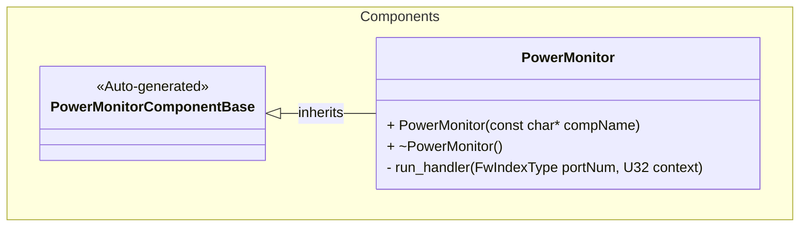
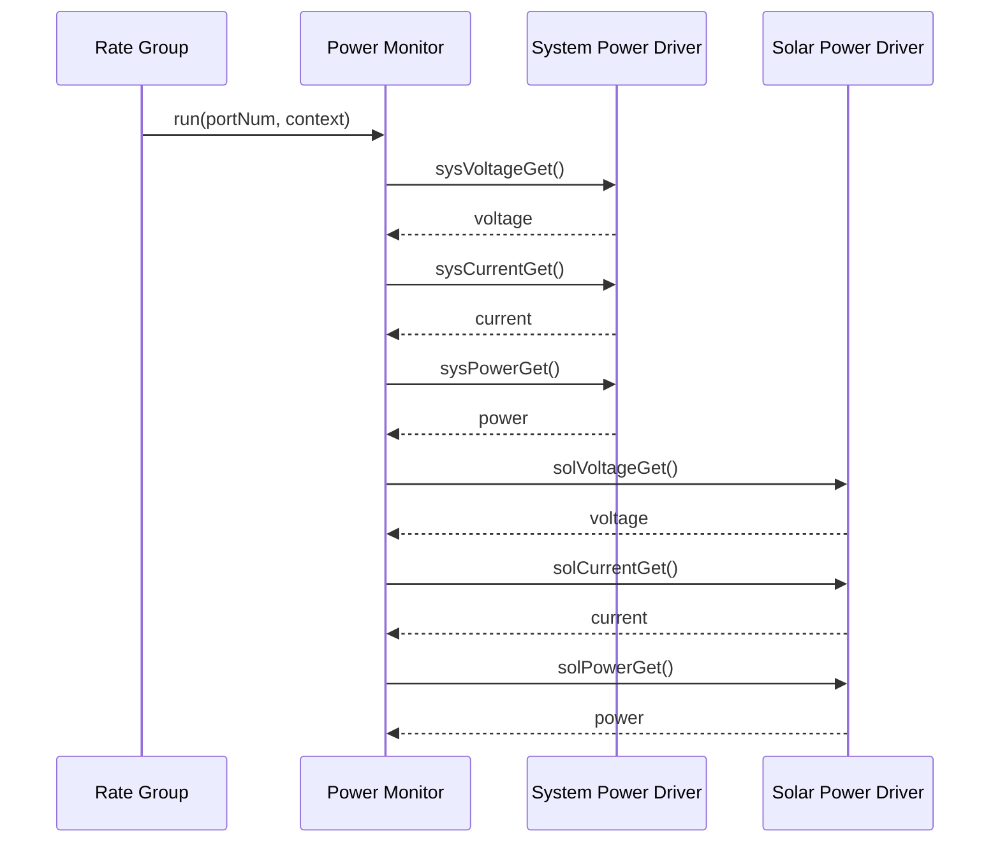

# Components::PowerMonitor

The Power Monitor component is a manager that coordinates power monitoring across multiple power sources. It periodically polls voltage, current, and power measurements from both system power and solar panel power sources.

## Usage Examples

The Power Monitor component is designed to run periodically via a rate group scheduler. It operates as a passive component that coordinates data collection from multiple power monitoring drivers.

### Typical Usage

1. The component is instantiated and initialized during system startup
2. The component is connected to:
   - A rate group scheduler (via the `run` input port)
   - System power monitoring driver (via `sys*` output ports)
   - Solar panel power monitoring driver (via `sol*` output ports)
3. On each scheduler cycle the component first checks whether this tick is due:
   it samples every `COLLECTION_INTERVAL_S` seconds (default 1, i.e. every
   tick). Ticks in between return immediately.
4. On an executing cycle:
   - The component calls all six output ports to trigger measurements
   - Each connected driver fetches sensor data and writes telemetry
   - The energy integrators add `power * dt` to the running totals
   - The component emits `CollectionIntervalS` with the interval in force
   - Power monitoring data becomes available system-wide

The integrators discard a sample gap they read as a clock jump. That window is
`max(10 s, 2 * COLLECTION_INTERVAL_S)`, so at the 1 s default it is 10 s —
identical to the fixed 10 s window used before the parameter existed — and a
longer interval widens it rather than freezing `TotalPowerConsumption`.

`COLLECTION_INTERVAL_S` is an ordinary F Prime parameter: `..._PRM_SET` latches
it into RAM immediately, and it persists across reboot with `PRM_SAVE_FILE` if
desired; a saved value is applied at boot through the F Prime 4.3.0
`parametersLoaded()` hook, before the first tick, with no PRM_SET needed
(A10). Without a save, a reboot restores the compiled default of 1 s.

## Parameters
| Name | Type | Description |
|---|---|---|
| COLLECTION_INTERVAL_S | U8 | Power-sampling interval in seconds, 1..60, default 1. Out-of-range or invalid values fall back to 1 |

## Telemetry
| Name | Type | Description |
|---|---|---|
| TotalPowerConsumption | F32 | Accumulated power consumption in mWh |
| TotalPowerGenerated | F32 | Accumulated solar power generation in mWh |
| CollectionIntervalS | U8 | The sampling interval actually in force, in seconds. Update on change; downlinked in the `PowerMonitor` packet (id 11, group 2) |

## Events
| Name | Description |
|---|---|
| TotalPowerReset | Accumulated power consumption was reset to 0 mWh |
| TotalGenerationReset | Accumulated power generation was reset to 0 mWh |
| TotalPowerConsumptionReading | Reports the accumulated power consumption on GET_TOTAL_POWER |
| CollectionIntervalRejected | Warning emitted when a requested COLLECTION_INTERVAL_S is out of range or the stored value is invalid; the 1 s default stays in force. Throttled at 5 |

## Class Diagram

## Port Descriptions
| Name | Type | Description |
|---|---|---|
| run | sync input | Scheduler port that triggers periodic power monitoring cycle |
| sysVoltageGet | output | Requests voltage measurement from system power driver |
| sysCurrentGet | output | Requests current measurement from system power driver |
| sysPowerGet | output | Requests power measurement from system power driver |
| solVoltageGet | output | Requests voltage measurement from solar panel power driver |
| solCurrentGet | output | Requests current measurement from solar panel power driver |
| solPowerGet | output | Requests power measurement from solar panel power driver |
| prmGetOut | param get | Port for getting parameters |
| prmSetOut | param set | Port for setting parameters |

## Sequence Diagrams

### Run Cycle

## Requirements
| Name | Description | Method | Level | Pass Criteria | Status | Reason |
|---|---|---|---|---|---|---|
|PWR-MON-REQ-001|The component shall respond to scheduler calls via the run port|Integration Test|Board|GET_TOTAL_POWER returns TotalPowerConsumptionReading > 0 and a second reading 10 s later is strictly greater (run port executing each cycle)|||
|PWR-MON-REQ-002|The component shall request voltage measurements from the system power driver on each run cycle|Integration test|||||
|PWR-MON-REQ-003|The component shall request current measurements from the system power driver on each run cycle|Integration test|||||
|PWR-MON-REQ-004|The component shall request power measurements from the system power driver on each run cycle|Integration Test|Board|TotalPowerConsumption increases between two readings 10 s apart, which requires a system power request on each 1 Hz run|||
|PWR-MON-REQ-005|The component shall request voltage measurements from the solar panel power driver on each run cycle|Integration test|||||
|PWR-MON-REQ-006|The component shall request current measurements from the solar panel power driver on each run cycle|Integration test|||||
|PWR-MON-REQ-007|The component shall request power measurements from the solar panel power driver on each run cycle|Integration test|||||
|PWR-MON-REQ-008|run shall sample the power monitors every COLLECTION_INTERVAL_S seconds (1..60), default 1 s|Unit Test|Unit|Over 12 ticks at interval 3 exactly 4 sample sweeps occur (ticks 1,4,7,10); at the default interval every tick samples|||
|PWR-MON-REQ-009|Energy accumulation shall remain correct at any configured collection interval, and an invalid interval shall fall back to 1 s|Unit Test|Unit|An interval of 0 or >60 or an INVALID param yields effective 1 s, one CollectionIntervalRejected event and CollectionIntervalS telemetry 1; TotalPowerConsumption keeps accumulating at interval 30 s|||
|PWR-MON-REQ-010|A COLLECTION_INTERVAL_S value saved in PrmDb shall be the effective sampling interval from the first run tick after boot, without any PRM_SET|Unit Test|Unit|With COLLECTION_INTERVAL_S = 3 VALID in the stub and no parameterUpdated call, after parametersLoaded() 12 ticks make exactly 4 system-power requests (ticks 1,4,7,10) and the first CollectionIntervalS write is 3; with paramValidity INVALID (host-stub case: on the target loadParameters leaves VALID or DEFAULT) every tick samples, one CollectionIntervalRejected, first write 1; a parameterUpdated after boot applies as today with no duplicate event|||

## Change Log
| Date | Description |
|---|---|
| 2026-09-19 | `parametersLoaded()` override applies a saved COLLECTION_INTERVAL_S at boot; before this the generated `loadParameters()` never reached `parameterUpdated` and a reboot ran on the 1 s default whatever was saved (A10, PWR-MON-REQ-010) |
| 2026-09-05 | Added COLLECTION_INTERVAL_S (1..60 s, default 1) decimation of the sampling cycle; CollectionIntervalS telemetry; CollectionIntervalRejected event; energy-accumulation window now max(10 s, 2 * interval) instead of a fixed 10 s (PWR-MON-REQ-008/009) |
| 2025-11-03 | Initial Power Monitor component |
