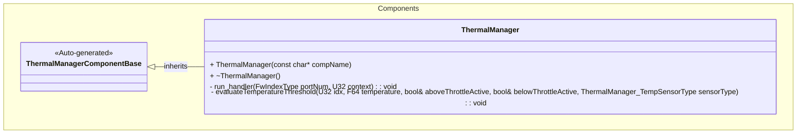
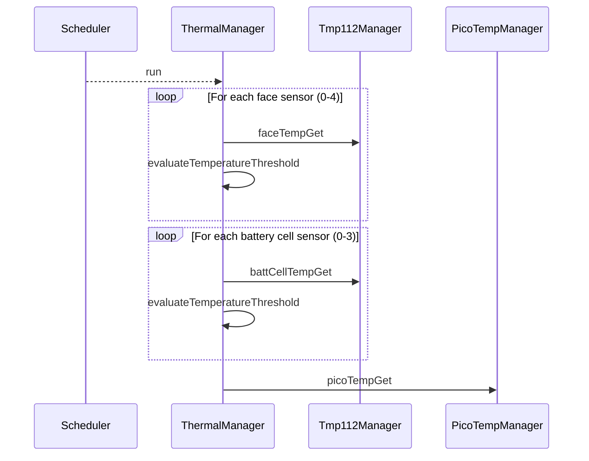

# Components::ThermalManager

The Thermal Manager component is responsible for orchestrating temperature sensor readings from multiple TMP112 sensors distributed across the spacecraft. It specifically manages sensors for the spacecraft faces and battery cells.

## Usage Examples

The Thermal Manager component is designed to be scheduled periodically to trigger collection of temperature data. It operates as a passive component that responds to scheduler calls.

### Typical Usage

1. The component is instantiated and initialized during system startup.
2. The scheduler calls the `run` port at regular intervals.
3. On each run call, the component first checks whether this tick is due: the
   sweep executes every `COLLECTION_INTERVAL_S` seconds (default 1, i.e. every
   tick). Ticks in between return immediately.
4. On an executing run call, the component:
   - Iterates through the connected face temperature sensor ports.
   - Iterates through the connected battery cell temperature sensor ports.
   - Triggers temperature readings for each connected sensor.
   - Triggers temperature reading from the Pico die temperature sensor.
   - Evaluates lower/upper threshold conditions for face and battery sensors with per-sensor hysteresis state
   - Emits `CollectionIntervalS` with the interval it is running at

Because threshold evaluation happens inside the sweep, a longer
`COLLECTION_INTERVAL_S` also lengthens fault-detection latency to that interval;
the 1 s default preserves the one-evaluation-per-second behaviour the
TM-L2-08 / FD-L2-03 criteria assume.

`COLLECTION_INTERVAL_S` is an ordinary F Prime parameter: `..._PRM_SET` latches
it into RAM immediately, and it persists across reboot with `PRM_SAVE_FILE` if
desired. Without a save, a reboot restores the compiled default of 1 s.

## Class Diagram

## Parameters

| Name                           | Type | Description                                                |
| ------------------------------ | ---- | ---------------------------------------------------------- |
| FACE_TEMP_LOWER_THRESHOLD      | F64  | Lower temperature threshold in °C for face sensors         |
| FACE_TEMP_UPPER_THRESHOLD      | F64  | Upper temperature threshold in °C for face sensors         |
| BATT_CELL_TEMP_LOWER_THRESHOLD | F64  | Lower temperature threshold in °C for battery cell sensors |
| BATT_CELL_TEMP_UPPER_THRESHOLD | F64  | Upper temperature threshold in °C for battery cell sensors |
| COLLECTION_INTERVAL_S          | U8   | Sensor-sweep interval in seconds, 1..60, default 1. Out-of-range or invalid values fall back to 1 |

## Port Descriptions

| Name            | Type         | Description                                                               |
| --------------- | ------------ | ------------------------------------------------------------------------- |
| run             | sync input   | Scheduler port that triggers temperature data collection                  |
| faceTempGet     | output       | Array of ports [5] for getting temperature data from face sensors         |
| battCellTempGet | output       | Array of ports [4] for getting temperature data from battery cell sensors |
| picoTempGet     | output       | Port for getting temperature data from Pico die temperature sensor        |
| faultOut        | output       | Port reporting each threshold crossing to the FaultManager                |
| timeCaller      | time get     | Port for requesting current system time                                   |
| tlmOut          | telemetry    | Port for emitting telemetry                                               |
| logOut          | event        | Port for emitting events                                                  |
| logTextOut      | text event   | Port for emitting text events                                             |
| prmGetOut       | param get    | Port for getting parameters                                               |
| prmSetOut       | param set    | Port for setting parameters                                               |
| cmdRegOut       | command reg  | Port for sending command registrations                                    |
| cmdIn           | command recv | Port for receiving commands                                               |
| cmdResponseOut  | command resp | Port for sending command responses                                        |

### Fault reporting

Beside each `TemperatureAboveThreshold` / `TemperatureBelowThreshold` event, the crossing is also
reported to `faultManager.faultIn` as `FACE_TEMP_HIGH`, `FACE_TEMP_LOW`, `BATT_TEMP_HIGH` or
`BATT_TEMP_LOW`, carrying the temperature that crossed. The report is purely observational: the
FaultManager's disposition is ignored, because the WARNING event is this component's whole response
to an out-of-range reading and the thermal fault types carry no recovery action. The existing
per-sensor latch and 3 °C hysteresis are unchanged, so there is exactly one report per event. An
unconnected `faultOut` is never called. See `Components/FaultManager/docs/sdd.md`.

## Events

| Name                      | Description                                                                                                                                    |
| ------------------------- | ---------------------------------------------------------------------------------------------------------------------------------------------- |
| TemperatureBelowThreshold | Event emitted when a face or battery sensor reading drops below its configured lower threshold; includes sensorType, sensorId, and temperature |
| TemperatureAboveThreshold | Event emitted when a face or battery sensor reading exceeds its configured upper threshold; includes sensorType, sensorId, and temperature     |
| CollectionIntervalRejected | Warning emitted when a requested COLLECTION_INTERVAL_S is out of range or the stored value is invalid; the 1 s default stays in force. Throttled at 5 |

## Telemetry

| Name                | Type | Description                                                                 |
| ------------------- | ---- | --------------------------------------------------------------------------- |
| CollectionIntervalS | U8   | The sweep interval actually in force, in seconds. Update on change; downlinked in the `Thermal` packet (id 12, group 3) |

## Sequence Diagrams

## Requirements

| Name | Description | Method | Level | Pass Criteria | Status | Reason |
|---|---|---|---|---|---|---|
|Face Temperature Collection|The component shall trigger data collection from connected face temperature sensors when run is called|Verify all connected face temperature output ports are called|||||
|Battery Temperature Collection|The component shall trigger data collection from connected battery cell temperature sensors when run is called|Verify all connected battery cell temperature output ports are called|||||
|Pico Temperature Collection|The component shall trigger data collection from the Pico die temperature sensor when run is called|Verify the Pico temperature output port is called|||||
|Threshold Monitoring|The component shall emit threshold events when face or battery sensor temperatures cross configured bounds|Verify `TemperatureBelowThreshold` and `TemperatureAboveThreshold` events are emitted appropriately|||||
|Threshold Hysteresis|The component shall suppress repeated threshold events until the measured temperature returns past a debounce band|Verify events are not re-emitted until the temperature re-enters the hysteresis band|||||
|Periodic Operation|The component shall operate as a scheduled component responding to scheduler calls|Verify component responds correctly to scheduler input|||||
|ThermalManager-1|run shall perform the sensor sweep every COLLECTION_INTERVAL_S seconds (1..60), default 1 s|Unit Test|Unit|Over 12 ticks at interval 3 exactly 4 sweeps occur (ticks 1,4,7,10); at the default interval every tick sweeps|||
|ThermalManager-2|An out-of-range or invalid COLLECTION_INTERVAL_S shall fall back to the 1 s default and report the rejection|Unit Test|Unit|An interval of 0 or >60 or an INVALID param yields effective 1 s, one CollectionIntervalRejected event, and CollectionIntervalS telemetry 1|||

## Change Log

| Date       | Description                                                                                                                                                                                                                   |
| ---------- | ----------------------------------------------------------------------------------------------------------------------------------------------------------------------------------------------------------------------------- |
| 2026-09-05 | Added `faultOut`: each threshold crossing is also reported to the FaultManager, beside the unchanged WARNING event. Observation only; the disposition is ignored (FaultManager-6)                                             |
| 2026-09-05 | Added COLLECTION_INTERVAL_S (1..60 s, default 1) decimation of the sensor sweep; CollectionIntervalS telemetry; CollectionIntervalRejected event (ThermalManager-1/2)                                                          |
| 2026-05-07 | Updated threshold handling to use per-sensor state and shared evaluation logic; eliminated global throttle-clear behavior. Added evaluateTemperatureThreshold helper function, removed sensor-type specific threshold events. |
| 2026-03-30 | Add Pico die temperature sensor integration                                                                                                                                                                                   |
| 2026-03-30 | Add events for when temperature readings are above/below a threshold.                                                                                                                                                         |
| 2025-12-05 | Initial Thermal Manager component SDD                                                                                                                                                                                         |
